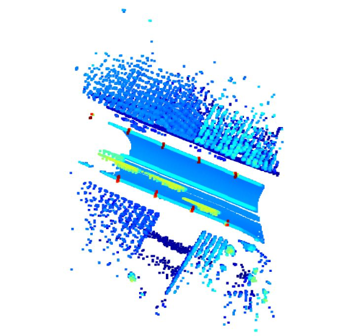
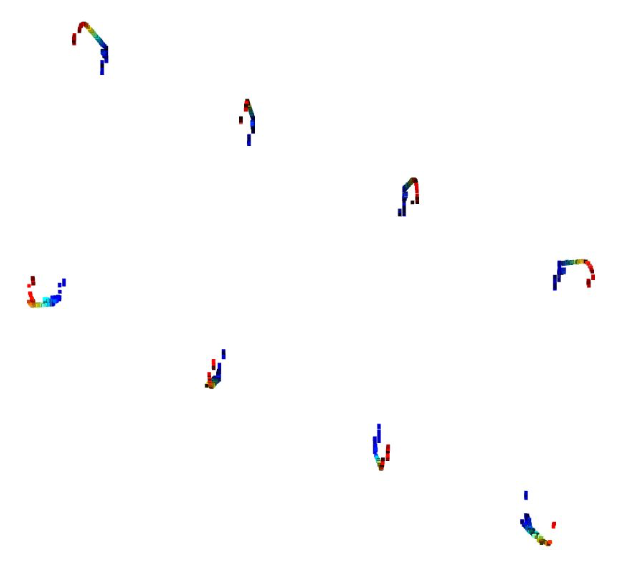

# Object Detection in Point Cloud: Poles
### Authors: Christopher Tsai, Anuj Karnik
Final project for EE 495: Geospatial Vision and Visualization, Northwestern University, Spring 2020.

## Introduction
Object detection in point cloud is popular in HD Maps and sensor-based autonomous driving. In this project, street poles (lampposts) were detected from an aerial view point cloud.

## Dependencies
- Open3D
- scikit-learn

## Raw Data

## Methodology
1. Convert raw point cloud data's coordinates from latitude-longitude-altitude coordinates to cartesian coordinates. Raw data is a `.fuse` file, which is similar to an Excel sheet file, and has columns of latitude, longitude, and altitude.
2. Filter data so that points that are likely to be on poles are separated.
3. Downsample data for efficiency, using Open3D functions `voxel_down_sample`, `uniform_down_sample`, and `statistical_outlier_removal`.
4. Implement a planar fitting algorithm to detect poles. This involves projecting points into x-y plane and using height data to select the poles. Since there’s no trees or other tall objects, this method selects only pole data.
5. Use k-means clustering to assign each point to a different cluster per pole.

## Results
After k-means clustering:

Final results:

## Discussion
- Algorithm is able to successfully detect and highlight poles, except for one pole in the left corner.
- Data is segregated to separate files so that it can be used for other applications.
- Future work should include an approach to detect poles in the corners of the point cloud, which are problematic as points are more sparse there.
